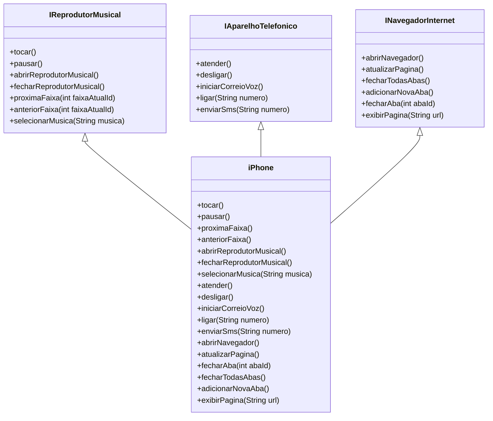

# [DIO](www.dio.me) - Trilha Java Básico
Este repositório é dedicado ao desafio de poo da trilha java básico da DIO

## POO - Desafio

### Modelagem e Diagramação de um Componente iPhone

Neste desafio, foi proposto modelar e diagramar a representação UML do componente iPhone, abrangendo suas funcionalidades como Reprodutor Musical, Aparelho Telefônico e Navegador na Internet.

#### Funcionalidades a Modelar
1. **Reprodutor Musical**
   - Métodos: `tocar()`, `pausar()`, `selecionarMusica(String musica)`
2. **Aparelho Telefônico**
   - Métodos: `ligar(String numero)`, `atender()`, `iniciarCorreioVoz()`
3. **Navegador na Internet**
   - Métodos: `exibirPagina(String url)`, `adicionarNovaAba()`, `atualizarPagina()`

#### Funcionalidades extras
1. **Reprodutor Musical**
   - Métodos: `proximaFaixa()`, `anteriorFaixa()`, `abrirReprodutorMusical`, `fecharReprodutorMusical`
2. **Aparelho Telefônico**
   - Métodos: `enviarSms()`, `desligar()`, `abrirReprodutorMusical`, `fecharReprodutorMusical`
3. **Navegador na Internet**
   - Métodos: `abrirNavegador()`, `+fecharAba(int abaId)`, `fecharTodasAbas()`

### Objetivo
1. Criar um diagrama UML que represente as funcionalidades descritas acima.
2. Implementar as classes e interfaces correspondentes em Java (Opcional).

### Diagrama UML do desafio

